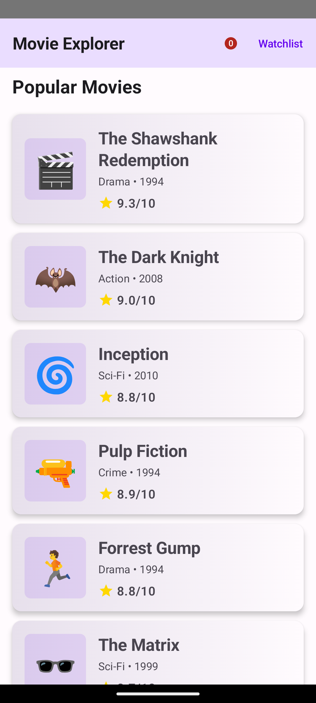
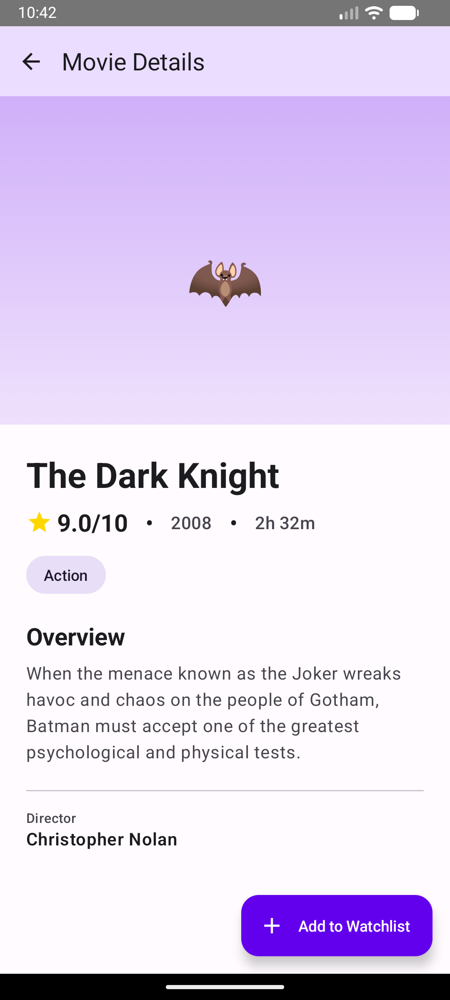
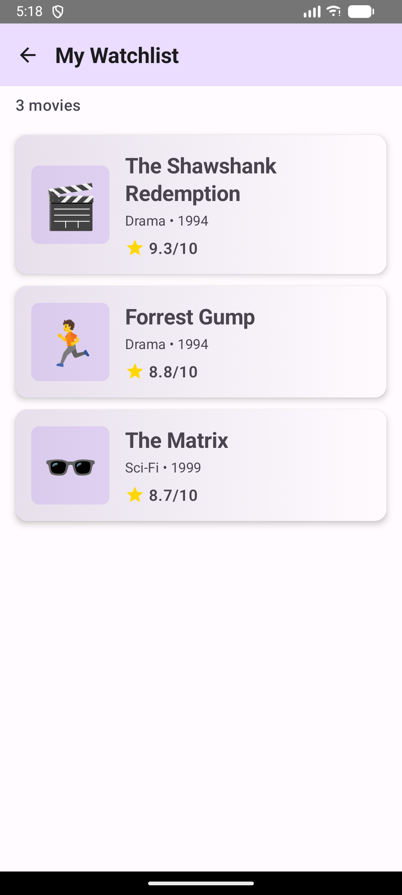

# 🎬 Movie Explorer App

A modern Android application built with Jetpack Compose that allows users to browse popular movies, view detailed information, and manage a personal watchlist.

## 📱 Screenshots

| Home Screen | Movie Details | Watchlist |
|-------------|---------------|-----------|
|  |  |  |


## 👥 Team Members

| Name | Email | CWID |
|------|-------|------|
| [Ansh Tomar] | [atomar1@csu.fullerton.edu] | [839813508] |

## ✨ Features

### Core Functionality
- ✅ **Browse Movies**: View a curated list of popular movies with ratings
- ✅ **Movie Details**: See comprehensive information including description, director, genre, and runtime
- ✅ **Watchlist Management**: Add/remove movies from your personal watchlist
- ✅ **Responsive Navigation**: Smooth transitions between screens
- ✅ **Real-time State Updates**: Dynamic UI updates based on user interactions

### Technical Features
- 🎨 **Modern UI**: Built entirely with Jetpack Compose
- 🔄 **State Management**: Proper state handling with ViewModel
- 🧭 **Navigation**: Type-safe navigation with Navigation Compose
- 📊 **Data Layer**: Well-structured data models
- 🎭 **Material Design 3**: Contemporary, polished UI design

## 🏗️ Architecture

This app follows Android's recommended architecture patterns:

```
app/
├── model/
│   └── Movie.kt                    # Data model
├── viewmodel/
│   └── MovieViewModel.kt           # Business logic & state
├── ui/
│   ├── screens/
│   │   ├── HomeScreen.kt          # Movie list screen
│   │   ├── DetailsScreen.kt       # Movie details screen
│   │   └── WatchlistScreen.kt     # Saved movies screen
│   └── theme/
│       ├── Theme.kt               # App theming
│       └── Type.kt                # Typography
├── navigation/
│   └── Navigation.kt              # Navigation setup
└── MainActivity.kt                # Entry point
```

## 🔧 Technical Stack

- **Language**: Kotlin
- **UI Framework**: Jetpack Compose
- **Architecture**: MVVM (Model-View-ViewModel)
- **State Management**: ViewModel + Compose State
- **Navigation**: Navigation Compose
- **Material Design**: Material 3 Components
- **Build System**: Gradle (Kotlin DSL)

## 📋 Requirements Met

### ✅ Functionality (40%)
- [x] 3+ functional screens with meaningful content
- [x] Smooth user interactions
- [x] Add/remove from watchlist functionality
- [x] Navigation between all screens
- [x] Hardcoded movie data (8 popular movies)

### ✅ State & ViewModel (25%)
- [x] ViewModel stores all app data
- [x] State properly managed with mutableStateListOf
- [x] UI updates reactively based on state changes
- [x] Watchlist state persists across screens

### ✅ Navigation (20%)
- [x] Navigation Compose implementation
- [x] Type-safe navigation with arguments
- [x] Back navigation handled correctly
- [x] Deep linking to movie details

### ✅ UI Design (15%)
- [x] Material Design 3 components
- [x] Consistent color scheme and typography
- [x] Professional card layouts
- [x] Proper spacing and alignment
- [x] Icons and visual hierarchy

### 🎨 Bonus (10 points)
- [x] Visually appealing gradient backgrounds
- [x] Smooth animations and transitions
- [x] Badge counter on watchlist button
- [x] Extended FAB on details screen
- [x] Empty state design for watchlist
- [x] Professional color scheme

## 🚀 Getting Started

### Prerequisites
- Android Studio Hedgehog or later
- JDK 8 or higher
- Android SDK (API level 24+)

### Installation

1. **Clone the repository**
   ```bash
   git clone https://github.com/yourusername/movie-explorer.git
   cd movie-explorer
   ```

2. **Open in Android Studio**
   - Open Android Studio
   - Select "Open an Existing Project"
   - Navigate to the cloned directory

3. **Build and Run**
   - Wait for Gradle sync to complete
   - Click the "Run" button or press `Shift + F10`
   - Select an emulator or connected device

## 📦 Project Structure

### Key Components

#### 1. **Movie Model** (`Movie.kt`)
```kotlin
data class Movie(
    val id: Int,
    val title: String,
    val description: String,
    val rating: Double,
    // ... other properties
)
```

#### 2. **MovieViewModel** (`MovieViewModel.kt`)
- Manages movie data and watchlist state
- Provides methods to toggle watchlist
- Exposes observable state to UI

#### 3. **Navigation** (`Navigation.kt`)
- Defines app navigation graph
- Type-safe route definitions
- Handles parameter passing

#### 4. **Screens**
- **HomeScreen**: Displays all movies in a scrollable list
- **DetailsScreen**: Shows full movie information with add/remove functionality
- **WatchlistScreen**: Displays saved movies

## 🎯 Key Learning Outcomes

This project demonstrates:
1. **Jetpack Compose UI Development**: Building entire UI with declarative components
2. **State Management**: Proper use of ViewModel and Compose state
3. **Navigation**: Implementing multi-screen navigation with parameters
4. **MVVM Architecture**: Separation of concerns between UI and business logic
5. **Material Design**: Creating modern, professional Android apps

## 🎥 Demo Video

**[[Link to Demo Video](https://youtube.com/shorts/UNTu9K9RDcQ?feature=share)]** (2-minute walkthrough)


## 📝 Code Highlights

### State Management Example
```kotlin
// ViewModel manages watchlist state
private val _watchlist = mutableStateListOf<Int>()

fun toggleWatchlist(movieId: Int) {
    if (movieId in _watchlist) {
        _watchlist.remove(movieId)
    } else {
        _watchlist.add(movieId)
    }
}
```

### Navigation Example
```kotlin
// Type-safe navigation to details screen
navController.navigate(Screen.Details.createRoute(movieId))
```

## 🐛 Known Issues & Future Enhancements

### Future Features
- [ ] Search functionality
- [ ] Filter by genre
- [ ] Sort by rating/year
- [ ] Movie trailers integration
- [ ] User reviews
- [ ] Dark mode support
- [ ] Persistent storage (Room database)
- [ ] API integration for real movie data

## 📄 License

This project was created as an educational assignment for [CPSC411A].

## 🙏 Acknowledgments

- Movie data is hardcoded for educational purposes
- UI design inspired by modern streaming platforms
- Built with Jetpack Compose best practices

---
